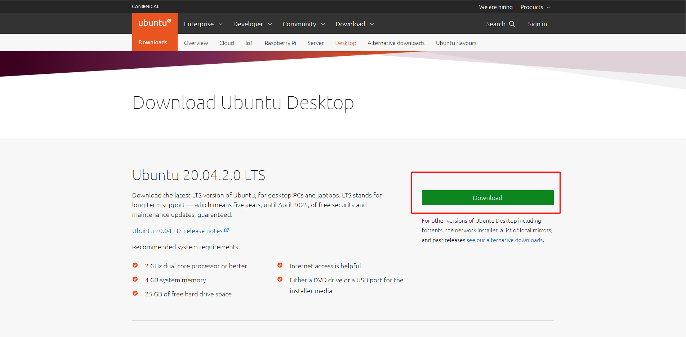
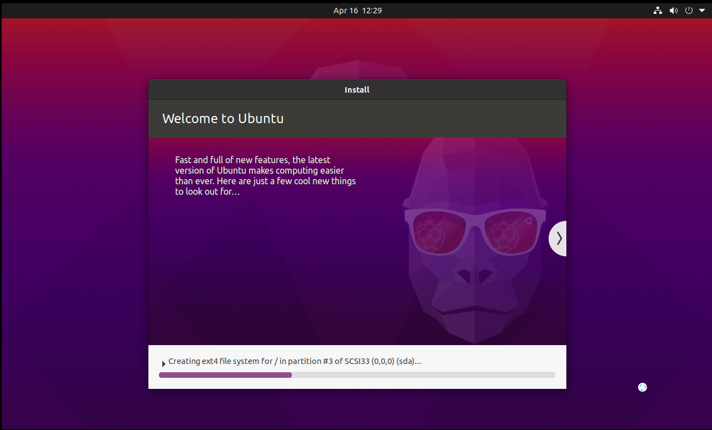
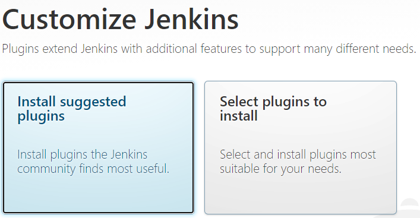

### How install Jenkins on VM with Linux (jenkins manual install)

*Jenkins — программная система с открытым исходным кодом на Java, предназначенная для обеспечения процесса непрерывной интеграции программного обеспечения.*  
  
*Apt — (advanced packaging tool) — программа для установки, обновления и удаления программных пакетов в операционных системах Debian и основанных на них (Ubuntu, Linux Mint и т. п.). Способна автоматически устанавливать и настраивать программы для UNIX-подобных операционных систем как из предварительно откомпилированных пакетов, так и из исходных кодов.*
*Apt — (apt-get) значительно упрощает процесс установки программ в командном режиме.*

*Wget — (свободная неинтерактивная консольная программа для загрузки файлов по сети. Поддерживает протоколы HTTP, FTP и HTTPS, а также поддерживает работу через HTTP прокси-сервер. Программа включена почти во все дистрибутивы GNU/Linux.*

*Systemd — это система инициализации и системный диспетчер для дистрибутивов Linux.*

*Ufq — является самым простым и довольно популярным в инструментарием командной строки для настройки и управления брандмауэром в дистрибутивах Ubuntu и Debian.*

# Шаг 1. Установка Виртуальной машины

В нашем случае будем пользоваться VMware Workstation Player. 

\- Выполняем загрузку и установку:

<https://www.vmware.com/products/workstation-player.html>

# Шаг 2. Скачивание образа операционной системы

\- Мы будем устанавливать Ubuntu, выполняем скачивание образа:

<https://ubuntu.com/download/desktop>

# Шаг 3. Установка Ubuntu

\- Запускаем VMware Workstation Player (прим. мы используем версию: «Non-commercial use only»);

Для установки образа нажимаем “Create a New Virtual Machine”

\- Выбираем путь к образу;

\- Нам предлагают персонализировать учетную запись; Создаем учетную запись для ОС;

\- Нажимаем далее и называем виртуальную машин;

\- Задаем объём памяти, который будет использоваться системой;

\- Выбираем один из вариантов:

“store virtual disk as a single file” – хранить виртуальный диск как один файл

или

“split virtual disk into multiple files’ – разбить виртуальный диск на несколько файлов, актуально в случаях, когда файловая система имеет ограничение по размеру файла или, когда HDD очень больших размеров.

\- Нажимаем “Next”, “Finish”.

# Шаг 4. Настройка Virtual Machine

В основном окне нашей VMware Workstation, мы можем увидеть созданную виртуалку. 

Выполним ее настройку: 

\- Выбираем созданную VM;

\- Нажимаем “Edit virtual machine settings”.

(здесь мы можем настроить VM, например: обьем оперативной памяти, кол-во ядер, разширение экрана виртуальной системы и т.д. )

# Шаг 5. Запуск Virtual Machine

При первом запуске Ubuntu автоматически установит системные пакеты, это займет некоторое время. ~~Можно сварить чай, или приготовить пельмени~~.

\- Входим в созданную ранее учетную запись.

# Шаг 6. Установка программных пакетов

Для установки будем использовать *Терминал* и пакетный менеджер *аpt* (обычно поставляется в дистрибутивах Debian и основанных на них)

Чтобы открыть терминал в системе Ubuntu нажимаем:

**CTRL+ALT+ T**

Далее продолжим установку в терминале (~$ – не является частью команды).

# 1) Установка Java

~$ sudo apt update – обновить репозиторий используется для установки новейших версий всех пакетов, установленных в настоящее время в системе, из источников, перечисленных в /etc/apt/sources.list;

~$ sudo apt search openjdk – поиск всех доступных пакетов;

\- Выбираем один из доступных, например – openjdk-11-jdk, вводим:

~$ sudo apt install openjdk-11-jdk  – установка выбранной версии;

\- Проверить версию установленной Java можно так:

~$ java –version

# 1) Установка пакетов wget

~$ sudo apt install wget - позволяет скачивать как отдельные файлы из интернета, так и сайты целиком, следуя по ссылкам на веб-страницах;

# Шаг 7. Установка Jenkins

Для начала добавим ключ репозитория Jenkins в систему, после добавления ключа система должна вернуть OK:

~$ wget -q -O - https://pkg.jenkins.io/debian/jenkins.io.key | sudo apt-key add -

~$ sudo sh -c 'echo deb http://pkg.jenkins.io/debian-stable binary/ > /etc/apt/sources.list.d/jenkins.list'

~$ sudo apt update

~$ sudo apt install jenkins – установка Jenkins;

~$ sudo systemctl start jenkins – запуск Jenkins ;

~$ sudo systemctl status jenkins – для проверки того, что Jenkins успешно запущен;

# 1) Настройка Firewall

По умолчанию, на наших виртуальных серверах *ufw* уже установлена, если по каким-то причинам требуется установка, то сделать это можно с помощью вашего пакетного менеджера.

~$ sudo apt install ufw

\- Включить firewall можно с помощью следующей команды:

~$ sudo ufw enable 

~$ sudo apt install ssh – установка программного обеспечения OpenSSH;

~$ sudo ufw allow OpenSSH – разрешать использование OpenSSH; 

По умолчанию Jenkins использует порт 8080, так что давайте откроем этот порт с помощью *ufw*:

~$ sudo ufw allow 8080 – разрешить порт 8080;

~$ sudo ufw status – отображает текущий статус и выводит все текущие правила;

# Шаг 8. Настройка Jenkins

\- Откроем Jenkins на используемом по умолчанию порте 8080, используя доменное имя вашего сервера или IP-адрес.

Откроем браузер и в адресной строке введем:

# http:// server\_ip\_or\_domain:8080/

Открылось окно разблокировки Jenkins

~$ sudo cat /var/lib/jenkins/secrets/initialAdminPassword – генерация пароля администратора;

\- Скопируем 32-символьный буквенно-цифровой пароль из командной строки и вставим его в поле Administrator password (вводиться один раз); Нажмем “Continue” (Продолжить).

Откроется окно установки плагинов. 

\- Выберем Install suggested plugins (рекомендуемые) и ждем окончания установки плагинов;

\- Далее создадим учетную запись администратора, нажимаем “Save and Continue”

\- Далее нажимаем “Start using Jenkins” (начать использование), чтобы открыть панель управления Jenkins. После этого установку Jenkins можно считать выполненной успешно.

